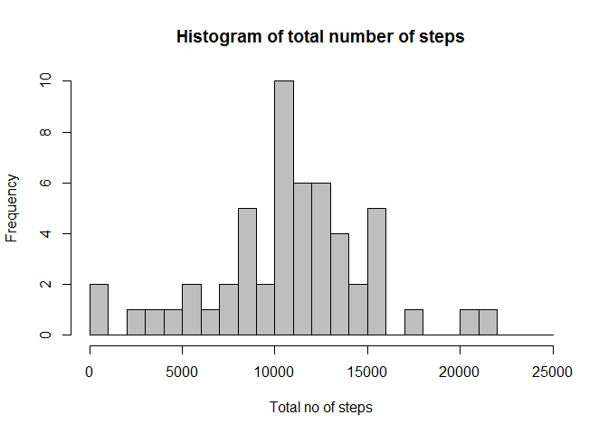
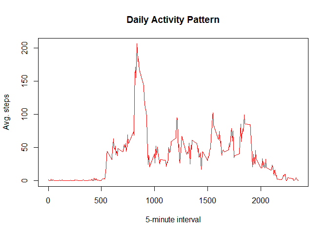

# Reproducible Research: Peer Assessment 1
Tahmid Rafi  
November 17, 2014  


## Setting up required libraries


```r
if(!is.element("dplyr", installed.packages()[,1])){
    install.packages("dplyr")
}

library(dplyr)
```


## Loading and preprocessing the data

First of all we need to unzip the data if not already done


```r
data.zip <- "activity.zip"
data.file <- "activity.csv"

if(!file.exists(data.file)){
    message("Unzipping File: ", data.zip)
    unzip(zipfile = data.zip)
}
```

as it is a csv file we load the file with `read.csv()` command.


```r
raw.data <- read.csv(data.file)
raw.data <- tbl_df(raw.data)
raw.data
```

```
## Source: local data frame [17,568 x 3]
## 
##    steps       date interval
## 1     NA 2012-10-01        0
## 2     NA 2012-10-01        5
## 3     NA 2012-10-01       10
## 4     NA 2012-10-01       15
## 5     NA 2012-10-01       20
## 6     NA 2012-10-01       25
## 7     NA 2012-10-01       30
## 8     NA 2012-10-01       35
## 9     NA 2012-10-01       40
## 10    NA 2012-10-01       45
## ..   ...        ...      ...
```

## What is mean total number of steps taken per day?

Let's take a look at the mean total number of steps taken per day.

```r
steps.per_day <- raw.data %>% 
  select(steps, date) %>% 
  group_by(date) %>% 
  summarize(total.steps = sum(steps)) %>% 
  arrange(as.Date(date))

head(steps.per_day, n=10)
```

```
## Source: local data frame [10 x 2]
## 
##          date total.steps
## 1  2012-10-01          NA
## 2  2012-10-02         126
## 3  2012-10-03       11352
## 4  2012-10-04       12116
## 5  2012-10-05       13294
## 6  2012-10-06       15420
## 7  2012-10-07       11015
## 8  2012-10-08          NA
## 9  2012-10-09       12811
## 10 2012-10-10        9900
```

Now let's look at the histogram of the data


```r
hist(steps.per_day$total.steps, 
     xlab = "Total no of steps", 
     main = "Histogram of total number of steps", 
     col = "grey", breaks = seq(0,25000,1000))
```

 

The mean and the median of total step taken per day are as follows.


```r
mean.step <- mean(steps.per_day$total.steps, na.rm = TRUE)
print(paste("The mean total number of steps taken per day is", format(mean.step, nsmall = 2, digits = 2)))
```

```
## [1] "The mean total number of steps taken per day is 10766.19"
```

```r
median.step <- median(steps.per_day$total.steps, na.rm = TRUE)
print(paste("The median total number of steps taken per day is", format(median.step, nsmall = 2, digits = 2)))
```

```
## [1] "The median total number of steps taken per day is 10765"
```


## What is the average daily activity pattern?

Now, Let us analyze the average daily activity pattern. 


```r
steps.per_interval <- raw.data %>% 
  select(steps, interval) %>% 
  group_by(interval) %>% 
  summarize(mean.steps = mean(steps, na.rm = TRUE))
```

Let's draw a plot


```r
plot(steps.per_interval, type= "l", 
     xlab = "5-minute interval", ylab = "Avg. steps", 
     main = "Daily Activity Pattern", col = "red")
```

 

Let's find out which time of the day or which interval has the most no of steps, averaged across all days?


```r
mostStepped <- steps.per_interval %>% arrange(desc(mean.steps))
print(mostStepped)
```

```
## Source: local data frame [288 x 2]
## 
##    interval mean.steps
## 1       835   206.1698
## 2       840   195.9245
## 3       850   183.3962
## 4       845   179.5660
## 5       830   177.3019
## 6       820   171.1509
## 7       855   167.0189
## 8       815   157.5283
## 9       825   155.3962
## 10      900   143.4528
## ..      ...        ...
```

Which shows that the most stepped interval is **835**


## Imputing missing values

#### Number of missing values


```r
sum(is.na(raw.data))
```

```
## [1] 2304
```

Let's fill out the `NA`'s with the mean value for the interval averages across all days


```r
for (i in 1:nrow(raw.data))
{
  if( is.na(raw.data[i,][['steps']]) ) {
    interval = raw.data[i,][['interval']]
    minute <- (interval %/% 100) * 60 + (interval %% 100)
    index = minute / 5 + 1
    raw.data[i,][['steps']] = steps.per_interval[index,][['mean.steps']]
    
  }
}

summary(raw.data)
```

```
##      steps                date          interval     
##  Min.   :  0.00   2012-10-01:  288   Min.   :   0.0  
##  1st Qu.:  0.00   2012-10-02:  288   1st Qu.: 588.8  
##  Median :  0.00   2012-10-03:  288   Median :1177.5  
##  Mean   : 37.38   2012-10-04:  288   Mean   :1177.5  
##  3rd Qu.: 27.00   2012-10-05:  288   3rd Qu.:1766.2  
##  Max.   :806.00   2012-10-06:  288   Max.   :2355.0  
##                   (Other)   :15840
```


## Are there differences in activity patterns between weekdays and weekends?
